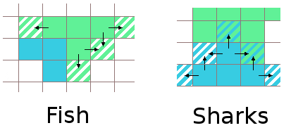
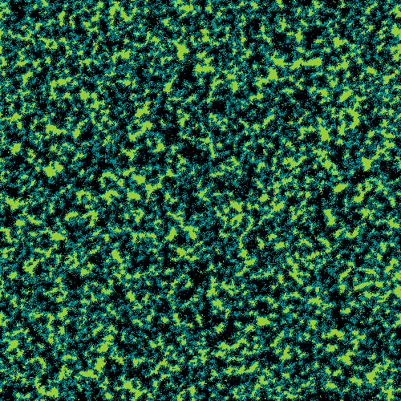
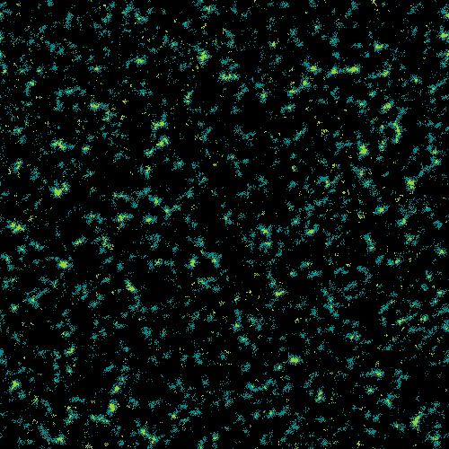
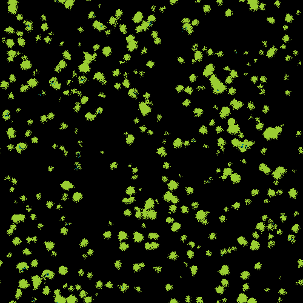
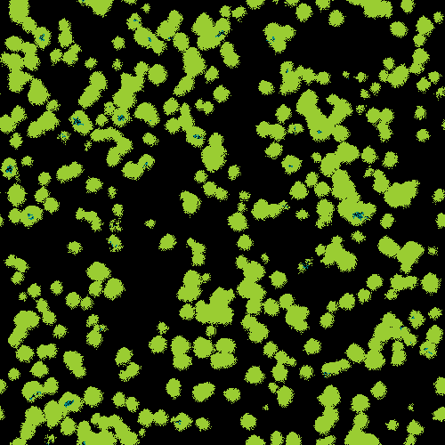

# Wator
Wator is the name for a discrete simulation for modeling a simple predator-prey model.

## Rules
Wa-Tor is usually implemented as a two-dimensional grid with three colours, one for fish, one for sharks and one for empty water. If a creature moves past the edge of the grid, it reappears on the opposite side. The sharks are predatory and eat the fish. Both sharks and fish live, move, reproduce and die in Wa-Tor according to the simple rules defined below. From these simple rules, complex emergent behavior can be seen to arise.

### For the fish
- At each chronon, a fish moves randomly to one of the adjacent unoccupied squares. If there are no free squares, no movement takes place.
- Once a fish has survived a certain number of chronons it may reproduce. This is done as it moves to a neighbouring square, leaving behind a new fish in its old position. Its reproduction time is also reset to zero.

### For the sharks
- At each chronon, a shark moves randomly to an adjacent square occupied by a fish. If there are none, the shark moves to a random adjacent unoccupied square. If there are no free squares, no movement takes place.
- At each chronon, each shark is deprived of a unit of energy.
- Upon reaching zero energy, a shark dies.
- If a shark moves to a square occupied by a fish, it eats the fish and earns a certain amount of energy.
- Once a shark has survived a certain number of chronons it may reproduce in exactly the same way as the fish.

## Results

## More Info
For more info see:
[Wikipedia - Wator](https://en.wikipedia.org/wiki/Wa-Tor)

FH Wiener Neustadt
Distributed and parallel systems - Student Project
